`2016-04-26`

    因為用了CocosCreator也有2.3個星期，  
    在 0.7 - 1.0.1 版本之間，我也用它做了一個小項目進行測試，算是稍為對它有一些暸解，    
    看著Creator在團隊大神們的努力下，它一點一點地進步，實在是激動啊 XD
    
    小弟想要先寫一編關於 Prefab 的簡單教程，  
    大概是從基礎的建立，到如何使用代碼控制Prefab，  
    但因為我也是Cocos的初學者，所以程度可能不會很好，  
    但若有多一個人因為教程而受益，那我也覺得值得了 :D
    
    跟各位大神比較下來，小弟這還是在關公面前耍大刀呢...( ´･▿･` )  
    因為很多觀念尚有不足，所以小弟的教程難免會有錯誤，還請各位多指教、多包涵啊 :D  
    廢話說了不少，該進入正題了...

## 基礎Prefab教程 - 1 - 開始製作第一個 Prefab

請各位將它用 CocosCreator 打開 (我目前使用的是 1.0.1版本)  

打開後，進入主場景
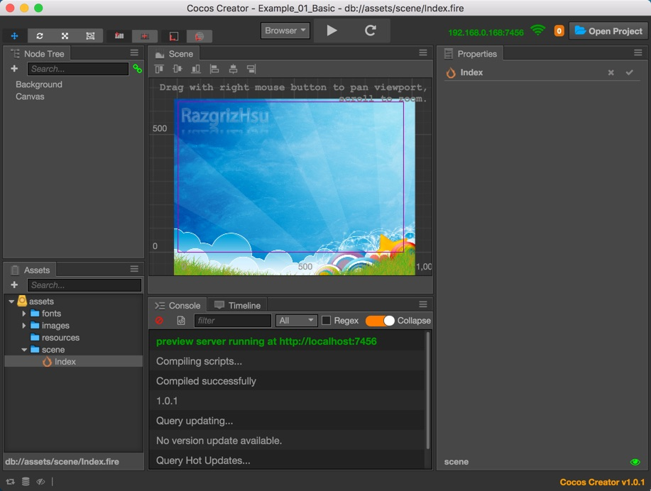

這時，  
我們從 NodeTree 可以看出來，畫面上只有2個Node，
1. 一個Sprite (背景圖-Background)
2. 一個Canvas (空白的畫布)

-------
###開始製作第一個 Prefab

簡單說，製作Prefab的方式就是..
1. 先將我們需要先將想要的樣式，排在畫面上
2. 將製作好的Node選取起來，拖曳至資源管理器 (Assets) 中

你就會看見它的圖示變成Prefab的圖示了，接著我們實際來操作下

首先我們看一下資源管理器，
目前我預先放了一些資源來拿做範本，如下圖，

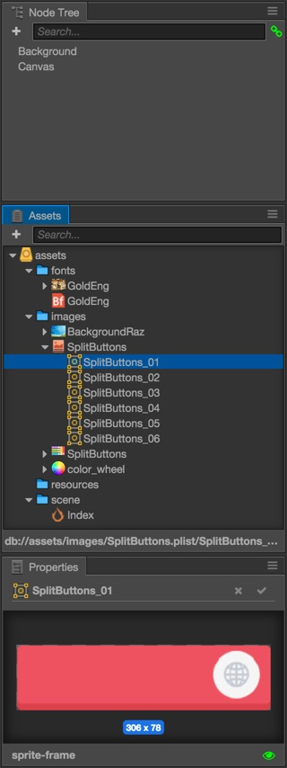

 1. 我們先在NodeTree裡，加入一個空白的Node，並且將它命名為 **MyPrefab**  
 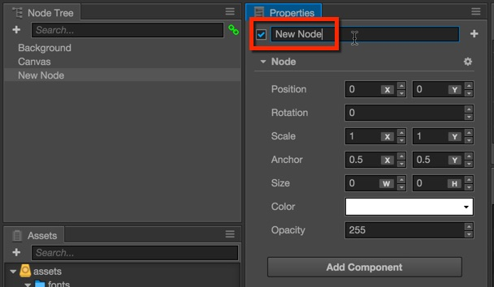

 2. 我們將圖集SplitButtons打開，將SplitButtons_01拉至MyPrefab的Node中
 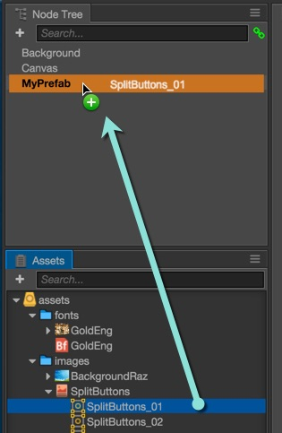

 3. 接著你應該會看到這樣的畫面，因為我們新建Node的關係，所以座標跑到左下角，
    這個部份是沒關係的，我們暫時先手動把它拉到畫面中間，方便我們編輯即可
    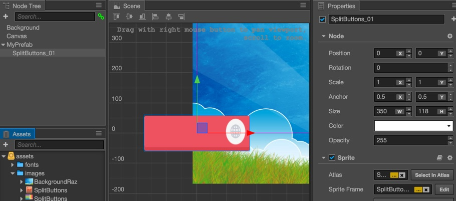

 4. 接著將資源中的 `assets/images/color_wheel.png` 放在我們這個Prefab的左方，命名為 **Color**
    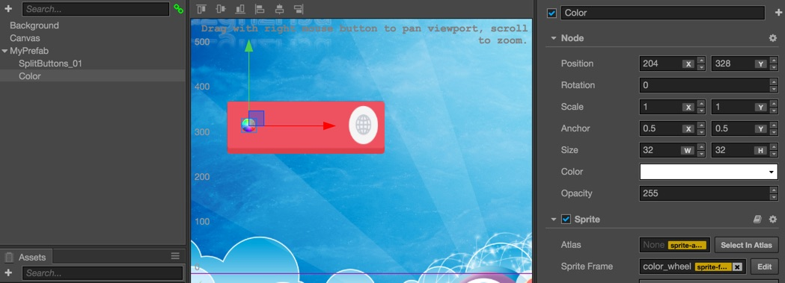

 5. 然後、在Node中，再增加一個Label，並且將其命名為 **Text**，
    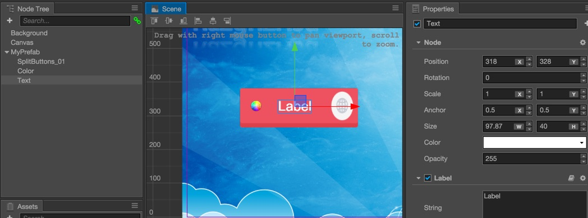
    接著將我預先準備好的位圖字體 `assets/fonts/GoldEng.fnt` 拉到Label的File屬性裡
    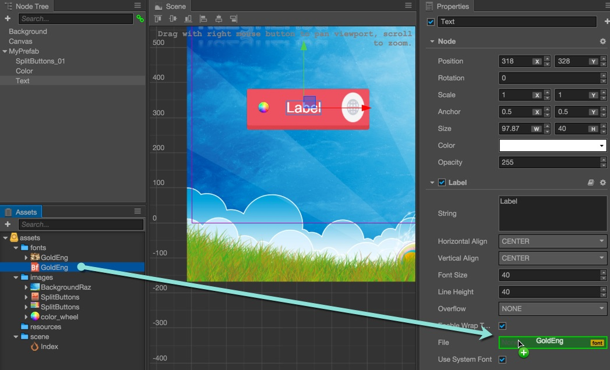

 6. 接著，稍為調整一下，我們的Prefab就做好了，你應該要可以看到像下面這樣的畫面..
    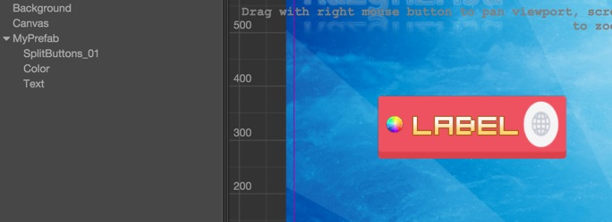

 7. 接下來，我們把  **MyPrefab** 這個Node往資源管理員下的 `assets/resources/` 拉進去，
    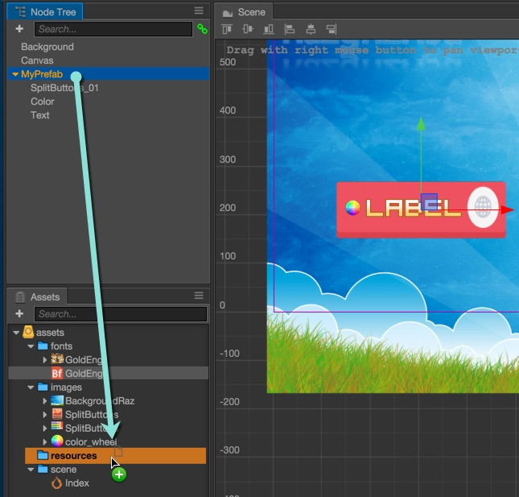

 8. 這樣我們就製作成一個可以使用的 Prefab 了
    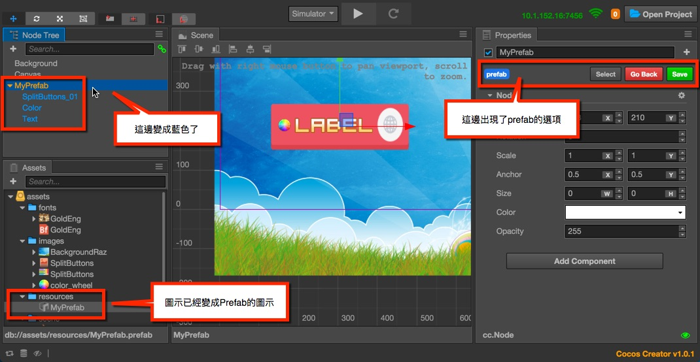

------

謝謝觀看 :D

