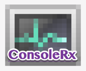
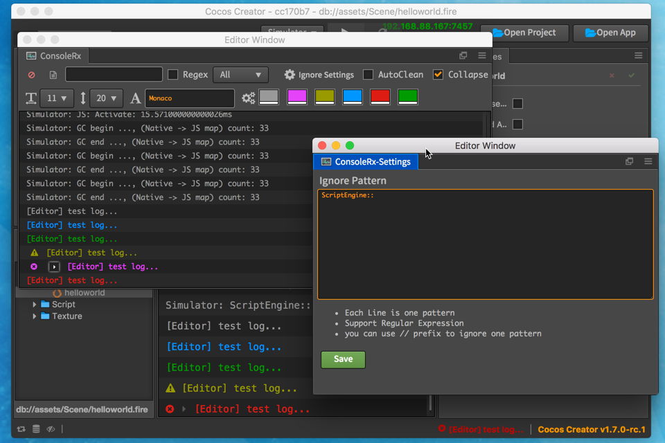

------------------------------------
Because I want more large console view,
so I made this Extension for CocosCreator, hope you enjoy the developing :)

##install
execute on Terminal
`bash <(curl -s https://raw.githubusercontent.com/RazgrizHsu/ConsoleRx/master/install.sh)`

**Feature & change log**
------------------------------------
- 1.3.2
  - adjust UI and fix cc 2.0 text selection issue

- 1.3.1
  - fix Creator 1.7 config place different error

- 1.3.0
  - add Feature for AutoClean log when PlayOnDevice

- 1.2.0
  - add Feature for ignore pattern settings

- 1.1.2
  - fix when Panel dock to MainFrame the messages duplicate issue
  - fix folding arrow size issue

- 1.1.1
  - fix folding information wrong styles issue
  - add folding arrow highlight

- 1.1.0
  - add Feature for adjust log type colors

- 1.0.0
  - Adjust FontSize and LineHeight
  - Choose you like Font-Family
------------------------------------